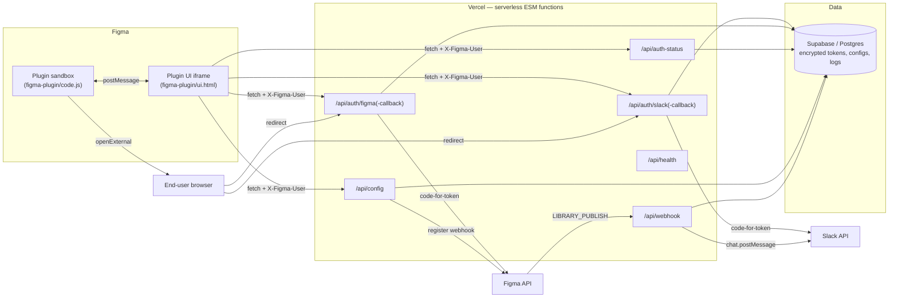

# Architecture

> Last updated: 2026-04-20

This document covers the high-level design of Library Pulse — the three runtime components, the data flow on each end-user action, and the security boundaries you cross moving between them.

For the rationale behind each architectural choice, see the ADRs in [`docs/adrs/`](./docs/adrs/).

---

## 1. System overview



The system has **three runtimes** with disjoint trust models:

1. **Figma plugin sandbox** (`figma-plugin/code.js`) — runs inside Figma's QuickJS sandbox. No network. No DOM. Only the `figma` global. Communicates with the UI iframe via `postMessage`.

2. **Figma plugin UI iframe** (`figma-plugin/ui.html`) — a `srcdoc` iframe rendered by Figma. Has DOM and `fetch`, but origin is `null`. The only network destinations it can reach are the ones listed in `manifest.json`'s `networkAccess.allowedDomains`.

3. **Vercel serverless backend** (`backend/api/*.js`) — Node 20 ESM. Holds the Slack/Figma client secrets and the AES encryption key. Talks to Supabase and to upstream Slack/Figma APIs.

The end-user browser is involved only during OAuth — it never sees an API call from the plugin.

---

## 2. Data flow: setup

```
End user clicks "Connect Slack" in plugin UI
   1. UI generates a UUID v4 state
   2. UI → POST /api/auth/slack { figmaUserId, state }
   3. Backend INSERTs auth_sessions row (status=pending, expires_at=+10min)
   4. Backend returns Slack authorize URL
   5. Plugin sandbox openExternal(url) → user's browser
   6. User authorizes in Slack
   7. Slack redirects browser to /api/auth/slack-callback?code=...&state=...
   8. Backend validates state, exchanges code for bot_token
   9. Backend AES-encrypts bot_token, UPSERTs slack_installations
  10. Backend marks auth_sessions(state) status=completed, used_at=now()
  11. Plugin UI is polling /api/auth-status?state=... every 2s
  12. UI sees status=completed → stores slack_team_id locally → updates view
```

Figma OAuth is structurally identical (different scopes, different upstream URL, different table).

---

## 3. Data flow: publish event

```
User publishes a library in Figma
   1. Figma fires LIBRARY_PUBLISH webhook → POST /api/webhook
      Headers: X-Figma-Passcode: <random per-team passcode>
   2. Backend looks up figma_webhooks by webhook_id
   3. Backend timing-safe-compares passcode header to stored value
   4. Backend derives an event_key from the payload
   5. Backend INSERTs into webhook_events (UNIQUE) — duplicate → 200 OK, no-op
   6. Backend SELECTs configurations WHERE figma_file_key = payload.file_key
                                    AND is_active = true
   7. For each config:
      a. Decrypt the Slack bot_token
      b. Build the Block Kit message (slack-blocks.js)
      c. POST chat.postMessage for each channel
         (concurrency capped at SLACK_POST_CONCURRENCY = 4)
      d. INSERT result into notification_log
   8. Return { status: "processed", results: [...] }
```

Per-team webhook is registered once when the first user in the team creates a config (`config.js` → `ensureWebhook`). Subsequent configs for the same team reuse it.

---

## 4. Security boundaries

| Boundary | Trust on the inside | What we do at the edge |
|---|---|---|
| Browser → `/api/auth/*-callback` | Untrusted query string | UUID-validate `state`, ignore unknown `error` codes, render escaped HTML only, hard CSP `default-src 'none'` |
| Plugin UI → backend | UI controls the body but Figma rate-limits it | Require `X-Figma-User` header, compare it to `figma_user_id` field in body, reject mismatches with 403 |
| Figma webhook → `/api/webhook` | Anyone can POST | Hard-require `webhook_id` + passcode header, `timingSafeEqual` compare, dedupe via `webhook_events` UNIQUE |
| Backend → Slack | Bot token is in env once decrypted | `fetchWithTimeout(8s)`, bounded concurrency, never log token |
| Backend → Supabase | Service-role key bypasses RLS | RLS still enabled in case the key leaks; structured logs scrub tokens |

The encryption key (`ENCRYPTION_KEY`) is the single root of secret in the system. If it leaks, every stored OAuth token must be revoked at the providers. See [`docs/runbooks/rotate-encryption-key.md`](./docs/runbooks/rotate-encryption-key.md).

---

## 5. Folder layout

```
library-pulse/
├── figma-plugin/              ← shipped to Figma plugin store
│   ├── manifest.json          ← network allow-list, plugin id, api version
│   ├── code.js                ← sandbox (no DOM, no network)
│   └── ui.html                ← iframe UI (DOM + fetch)
├── backend/                   ← Vercel serverless functions
│   ├── api/                   ← each file = one HTTP endpoint
│   ├── lib/                   ← shared helpers (encryption, validators, logger, …)
│   ├── package.json
│   └── vercel.json
├── database/
│   ├── schema.sql             ← canonical full schema for fresh installs
│   └── migrations/            ← (when we ship migrations) one .sql per change
├── docs/
│   ├── adrs/                  ← Architecture Decision Records, numbered
│   └── runbooks/              ← step-by-step playbooks (rollback, IR, key rotation, …)
├── tests/                     ← Vitest unit tests
├── scripts/                   ← CI helper scripts (manifest validation, drift check)
└── .github/                   ← workflows + templates
```

---

## 6. Dependencies (one line each)

| Package | Why |
|---|---|
| `@supabase/supabase-js` | Postgres client + service-role auth |
| `node:crypto` | AES-256-GCM + `timingSafeEqual` for the webhook passcode |
| `ajv` | JSON Schema validation for `manifest.json` in CI |
| `eslint` v9 + plugins | Code quality; flat config per v2 §T2 |
| `vitest` + `@vitest/coverage-v8` | Unit tests with v8 coverage |
| `husky` + `lint-staged` + `commitlint` | Pre-commit hygiene |
| `prettier` | Formatting (config-driven, no surprises) |
| `typescript` | `tsc` runs in `checkJs` mode against `.js` sources; no `.ts` files yet |

We deliberately have **zero runtime web frameworks** — every endpoint is a default-export handler that takes `(req, res)`. Vercel's runtime gives us the rest.

---

## 7. Performance budget

The Slack post path is the only one that runs under load.

| Stage | Target |
|---|---|
| Webhook receipt → first Slack post | < 800 ms p95 |
| Per-channel Slack post (`chat.postMessage`) | < 2000 ms (8 s hard timeout) |
| Total fan-out for 3 configs × 3 channels | < 4 s p95 |
| Backend cold start | < 1 s (single-file handlers, no top-level await) |

Vercel's `maxDuration: 15` is the safety net. If we ever need a longer one (large fan-out), the webhook handler should respond `202` early and process out-of-band via a queue — see ADR-004 for the eventual queue migration plan.

---

## 8. Observability

- **Logs:** every backend module imports `lib/logger.js`. One JSON line per event; secrets are redacted by key name (`token`, `secret`, `passcode`, …).
- **Vercel:** function logs flow to the Vercel dashboard. Filter by `event` to see e.g. `webhook_duplicate_skipped` rates.
- **Sentry:** see [`docs/runbooks/incident-response.md`](./docs/runbooks/incident-response.md) for wiring once the project is ready.
- **`notification_log`:** every Slack post (success or failure) gets a row. Use it to find which channel a config keeps failing in.

---

## 9. What's intentionally out of scope

- **User accounts on Library Pulse itself.** Auth is delegated to Slack + Figma. We never issue our own session cookies.
- **Multi-tenancy isolation beyond `figma_user_id`.** The `X-Figma-User` header is the trust root for per-user calls; a malicious plugin host could forge it. Acceptable today because the plugin is the only client.
- **Real-time UI updates.** The plugin polls `auth-status` rather than maintaining a websocket. Polling is simple and adequate for a 10-minute OAuth window.
- **Localization.** English only for now.
