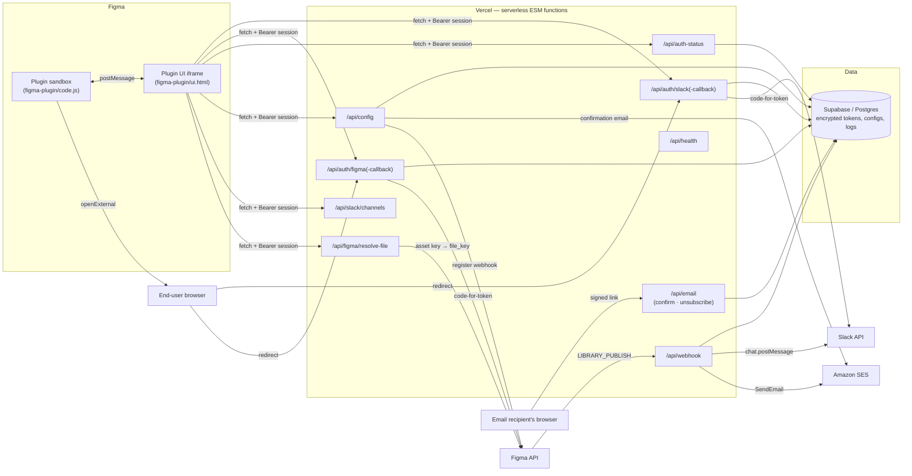

# Architecture

> Last updated: 2026-09-29

This document covers the high-level design of Library Pulse — the three runtime components, the data flow on each end-user action, and the security boundaries you cross moving between them.

For the rationale behind each architectural choice, see the ADRs in [`docs/adrs/`](./docs/adrs/).

---

## 1. System overview


```mermaid
flowchart LR
    subgraph Figma
        Plugin["Plugin sandbox<br/>(figma-plugin/code.js)"]
        UI["Plugin UI iframe<br/>(figma-plugin/ui.html)"]
        Plugin <--postMessage--> UI
    end

    subgraph Vercel["Vercel — serverless ESM functions"]
        AuthSlack["/api/auth/slack(-callback)"]
        AuthFigma["/api/auth/figma(-callback)"]
        Status["/api/auth-status"]
        Config["/api/config"]
        SlackChannels["/api/slack/channels"]
        EmailLinks["/api/email<br/>(confirm · unsubscribe)"]
        ResolveFile["/api/figma/resolve-file"]
        Webhook["/api/webhook"]
        Health["/api/health"]
    end

    subgraph Data
        SB[(Supabase / Postgres<br/>encrypted tokens, configs, logs)]
    end

    Browser["End-user browser"]
    SlackAPI["Slack API"]
    SES["Amazon SES"]
    Recipient["Email recipient's browser"]
    FigmaAPI["Figma API"]

    UI -- fetch + Bearer session --> AuthSlack & AuthFigma & Status & Config & SlackChannels & ResolveFile
    ResolveFile -- asset key → file_key --> FigmaAPI
    Plugin -- openExternal --> Browser
    Browser -- redirect --> AuthSlack
    Browser -- redirect --> AuthFigma
    AuthSlack & AuthFigma & Status & Config & Webhook & EmailLinks --> SB
    Recipient -- signed link --> EmailLinks
    Config -- confirmation email --> SES
    AuthSlack -- code-for-token --> SlackAPI
    AuthFigma -- code-for-token --> FigmaAPI
    Config -- register webhook --> FigmaAPI
    FigmaAPI -- LIBRARY_PUBLISH --> Webhook
    Webhook -- chat.postMessage --> SlackAPI
    Webhook -- SendEmail --> SES
```

The system has **three runtimes** with disjoint trust models:

1. **Figma plugin sandbox** (`figma-plugin/code.js`) — runs inside Figma's QuickJS sandbox. No network. No DOM. Only the `figma` global. Communicates with the UI iframe via `postMessage`.

2. **Figma plugin UI iframe** (`figma-plugin/ui.html`) — a `srcdoc` iframe rendered by Figma. Has DOM and `fetch`, but origin is `null`. The only network destinations it can reach are the ones listed in `manifest.json`'s `networkAccess.allowedDomains`.

3. **Vercel serverless backend** (`backend/api/*.js`) — Node 22 ESM. Holds the Slack/Figma client secrets, the SES sending credentials and the AES encryption key. Talks to Supabase and to the upstream Slack, Figma and Amazon SES APIs.

The end-user browser is involved only during OAuth — it never sees an API call from the plugin. An email recipient's browser only ever opens the two link pages (`/api/email?action=confirm` and `/api/email?action=unsubscribe`).

---

## 2. Data flow: setup

```
End user clicks "Connect Slack" in plugin UI
   1. UI generates a UUID v4 state
   2. UI → POST /api/auth/slack { figmaUserId, state }
   3. Backend INSERTs auth_sessions row (status=pending, expires_at=+10min)
   4. Backend returns Slack authorize URL
   5. Plugin sandbox openExternal(url) → user's browser
   6. User authorizes in Slack
   7. Slack redirects browser to /api/auth/slack-callback?code=...&state=...
   8. Backend validates state, exchanges code for bot_token
   9. Backend AES-encrypts bot_token, UPSERTs slack_installations
  10. Backend marks auth_sessions(state) status=completed, used_at=now()
  11. Plugin UI is polling /api/auth-status?state=... every 2s
  12. UI sees status=completed → stores slack_team_id locally → updates view
```

Figma OAuth is structurally identical (different scopes, different upstream URL, different table).

The email destination has no OAuth. Saving a list of addresses stores each new one as `pending` and sends it a confirmation email; the recipient's click on **Confirm address** (`POST /api/email?action=confirm`, authorized by the signed token in the link) flips it to `confirmed`.

---

## 3. Data flow: publish event

```
User publishes a library in Figma
   1. Figma fires LIBRARY_PUBLISH webhook → POST /api/webhook
      Headers: X-Figma-Passcode: <random per-webhook passcode>
   2. Backend looks up figma_webhooks by webhook_id
   3. Backend timing-safe-compares passcode header to stored value
   4. Backend derives an event_key from the payload
   5. Backend INSERTs into webhook_events (UNIQUE) — duplicate → 200 OK, no-op
   6. Backend SELECTs configurations WHERE figma_file_key = payload.file_key
                                    AND is_active = true
   7. For each config, by destination:
      Slack
      a. Decrypt the Slack bot_token
      b. Build the Block Kit message (slack-blocks.js)
      c. POST chat.postMessage for each channel
         (concurrency capped at SLACK_POST_CONCURRENCY = 4)
      d. INSERT result into notification_log
      Email
      a. Take the addresses whose status is "confirmed"
      b. Skip any already sent this event (notification_log.recipient),
         then apply the per-file daily cap
      c. Build the email (email-message.js) with that recipient's own
         unsubscribe link, and SendEmail through Amazon SES, one recipient
         per call (concurrency capped at 4)
      d. INSERT result into notification_log
   8. Return { status: "processed", results: [...] }
```

Configuration is **org-shared per file**: there is one config and one webhook per file, registered by the original setter with their own Figma token (`config.js` → `ensureWebhook`). Step 6 finds the file's single active config. Slack revocation detected in step 7 flips the config's `delivery_status` so the plugin shows a "reconnect" banner.

---

## 4. Security boundaries

| Boundary                         | Trust on the inside                | What we do at the edge                                                                                                                                                                          |
| -------------------------------- | ---------------------------------- | ----------------------------------------------------------------------------------------------------------------------------------------------------------------------------------------------- |
| Browser → `/api/auth/*-callback` | Untrusted query string             | UUID-validate `state`, ignore unknown `error` codes, render escaped HTML only, hard CSP `default-src 'none'`                                                                                    |
| Plugin UI → backend              | UI controls the body               | Require an HMAC-signed `Authorization: Bearer` session token (bound to the Figma user id); for a file's shared config, trust the setter and verify other users' file access via `webhooks:read` |
| Figma webhook → `/api/webhook`   | Anyone can POST                    | Hard-require `webhook_id` + passcode header, `timingSafeEqual` compare, dedupe via `webhook_events` UNIQUE                                                                                      |
| Backend → Slack                  | Bot token is in env once decrypted | `fetchWithTimeout(8s)`, bounded concurrency, never log token                                                                                                                                    |
| Backend → Amazon SES             | IAM key limited to sending         | Explicit `SES_*` credentials (never the ambient `AWS_*`), one attempt with 3 s connect / 5 s request timeouts, one recipient per call, addresses masked in logs                                 |
| Recipient → `/api/email`         | Anyone can open the URL            | HMAC-signed token bound to one config + one address (confirm links expire in 7 days); `GET` only renders, `POST` acts; escaped HTML under a no-script CSP                                       |
| Backend → Supabase               | Service-role key bypasses RLS      | RLS still enabled in case the key leaks; structured logs scrub tokens                                                                                                                           |

The encryption key (`ENCRYPTION_KEY`) is the single root of secret in the system. If it leaks, every stored OAuth token must be revoked at the providers. See [`docs/runbooks/rotate-encryption-key.md`](./docs/runbooks/rotate-encryption-key.md).

---

## 5. Folder layout

```
library-pulse/
├── figma-plugin/              ← shipped to Figma plugin store
│   ├── manifest.json          ← network allow-list, plugin id, api version
│   ├── code.js                ← sandbox (no DOM, no network)
│   └── ui.html                ← iframe UI (DOM + fetch)
├── backend/                   ← Vercel serverless functions
│   ├── api/                   ← each file = one HTTP endpoint = one Vercel Function
│   ├── lib/                   ← shared helpers (encryption, validators, logger, …)
│   ├── package.json
│   └── vercel.json
├── database/
│   ├── schema.sql             ← canonical full schema for fresh installs
│   └── migrations/            ← (when we ship migrations) one .sql per change
├── docs/
│   ├── adrs/                  ← Architecture Decision Records, numbered
│   └── runbooks/              ← step-by-step playbooks (rollback, IR, key rotation, …)
├── tests/                     ← Vitest unit tests
├── scripts/                   ← CI helper scripts (manifest validation, drift check)
└── .github/                   ← workflows + templates
```

---

## 6. Dependencies (one line each)

| Package                                | Why                                                                    |
| -------------------------------------- | ---------------------------------------------------------------------- |
| `@supabase/supabase-js`                | Postgres client + service-role auth                                    |
| `@aws-sdk/client-sesv2`                | Sending email through Amazon SES (request signing included)            |
| `node:crypto`                          | AES-256-GCM + `timingSafeEqual` for the webhook passcode               |
| `ajv`                                  | JSON Schema validation for `manifest.json` in CI                       |
| `eslint` v9 + plugins                  | Code quality; flat config per v2 §T2                                   |
| `vitest` + `@vitest/coverage-v8`       | Unit tests with v8 coverage                                            |
| `husky` + `lint-staged` + `commitlint` | Pre-commit hygiene                                                     |
| `prettier`                             | Formatting (config-driven, no surprises)                               |
| `typescript`                           | `tsc` runs in `checkJs` mode against `.js` sources; no `.ts` files yet |

We deliberately have **zero runtime web frameworks** — every endpoint is a default-export handler that takes `(req, res)`. Vercel's runtime gives us the rest.

**Function budget.** Without a framework, every file under `backend/api/` becomes its own Vercel Function, and "for Hobby, this approach is limited to 12 Vercel Functions per deployment" ([vercel.com/docs/functions/runtimes](https://vercel.com/docs/functions/runtimes)). A thirteenth doesn't fail the build: the deployment errors afterwards with nothing in the build log (seen 2026-09-29). So related endpoints share a Function: `backend/api/` holds 7 files, and `vercel.json` is the only place that maps the 12 public paths to them, rewriting e.g. `/api/auth/figma` to `/api/auth.js?fn=figma-start`. `lib/dispatch.js` reads `fn` and hands the request to the handler, which lives unchanged under `lib/handlers/`. `tests/vercel-function-count.test.js` pins the public paths, the file count, and that every `fn` names a handler the file has. A new destination (Google Chat, Teams) gets one file with its events, OAuth and listing endpoints behind `fn`.

---

## 7. Performance budget

The delivery path (Slack posts or emails) is the only one that runs under load. An email config sends at most five messages per publish, in two batches, each bounded by the SES timeouts above.

| Stage                                       | Target                                           |
| ------------------------------------------- | ------------------------------------------------ |
| Webhook receipt → first Slack post          | < 800 ms p95                                     |
| Per-channel Slack post (`chat.postMessage`) | < 2000 ms (8 s hard timeout)                     |
| Total fan-out for 3 configs × 3 channels    | < 4 s p95                                        |
| Backend cold start                          | < 1 s (single-file handlers, no top-level await) |

Vercel's `maxDuration: 15` is the safety net. If we ever need a longer one (large fan-out), the webhook handler should respond `202` early and process out-of-band via a queue — see ADR-004 for the eventual queue migration plan.

---

## 8. Observability

- **Logs:** every backend module imports `lib/logger.js`. One JSON line per event; secrets are redacted by key name (`token`, `secret`, `passcode`, …).
- **Vercel:** function logs flow to the Vercel dashboard. Filter by `event` to see e.g. `webhook_duplicate_skipped` rates.
- **Sentry:** see [`docs/runbooks/incident-response.md`](./docs/runbooks/incident-response.md) for wiring once the project is ready.
- **`notification_log`:** every Slack post and every email, including confirmation emails (`event_type = 'EMAIL_CONFIRM'`), gets a row, success or failure. Use it to find which channel or recipient a config keeps failing for; `error_message` holds the Slack error or the SES error name.

---

## 9. What's intentionally out of scope

- **User accounts on Library Pulse itself.** Auth is delegated to Slack + Figma. We never issue our own session cookies.
- **Multi-tenancy isolation beyond `figma_user_id`.** The `X-Figma-User` header is the trust root for per-user calls; a malicious plugin host could forge it. Acceptable today because the plugin is the only client.
- **Real-time UI updates.** The plugin polls `auth-status` rather than maintaining a websocket. Polling is simple and adequate for a 10-minute OAuth window.
- **Localization.** English only for now.
